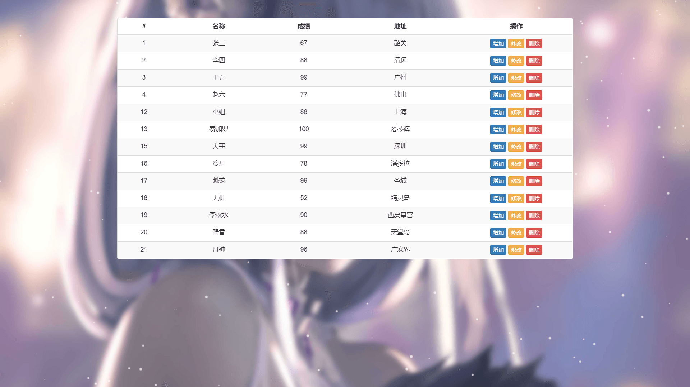
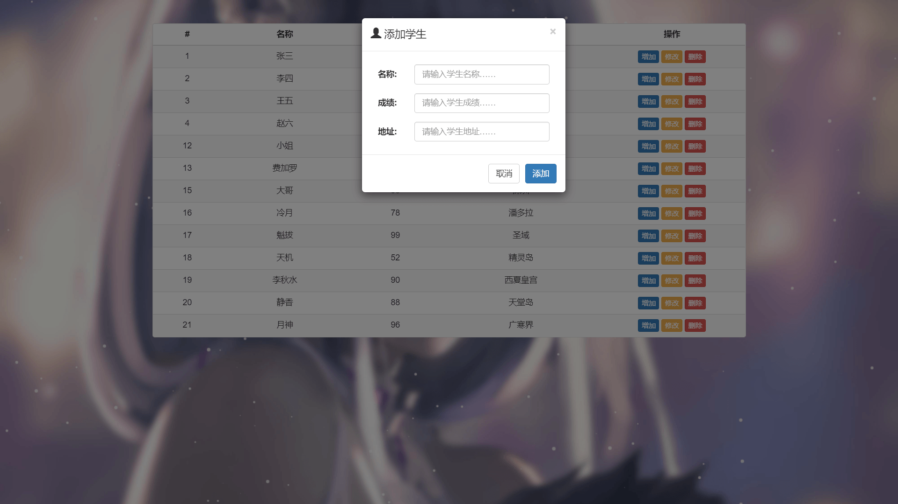
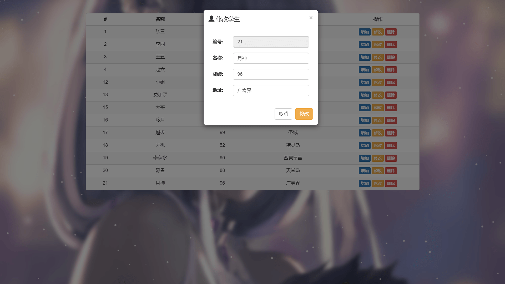

# 学生成绩管理（RESTful API）

#### 介绍
本项目为学习与练习项目，使用 RESTful 风格的接口设计规范实现学生成绩管理功能。主要功能包括成绩展示、成绩添加、成绩修改以及成绩删除。

#### 链接
学生成绩管理：[http://software.yongkj.cn/restful/](http://software.yongkj.cn/restful/)

#### 截图

#### 技术栈
MySQL+SpringBoot+Spring+SpringMVC+Jpa+HTML+CSS+JS+JQuery

1.  前端使用了 JQuery 框架 + Ajax 异步刷新来解析、渲染json数据
2.  后端则使用 SpringBoot 整合 SSJ 框架（Spring + SpringMVC + Jpa）来完成开发工作
3.  使用 Gradle 构建工具管理 Jar 包的依赖关系
4.  利用 particles.js 轻量级粒子背景库实现下雪背景特效
5.  后台的数据存储主要采用开源的 Mariadb 数据库来完成

#### 功能特性

1.  学生成绩的展示、增加、修改以及删除
2.  进行增加、修改或者删除操作后自动刷新成绩列表

#### 使用说明

1.  ssm.sql 为数据库备份文件
2.  可在 src/main/resources/application.properties 文件中修改数据库连接信息
3.  如需打包部署服务器，则可以使用 Eclipse 或者 IDEA 打包项目，默认打包为 Jar 包
